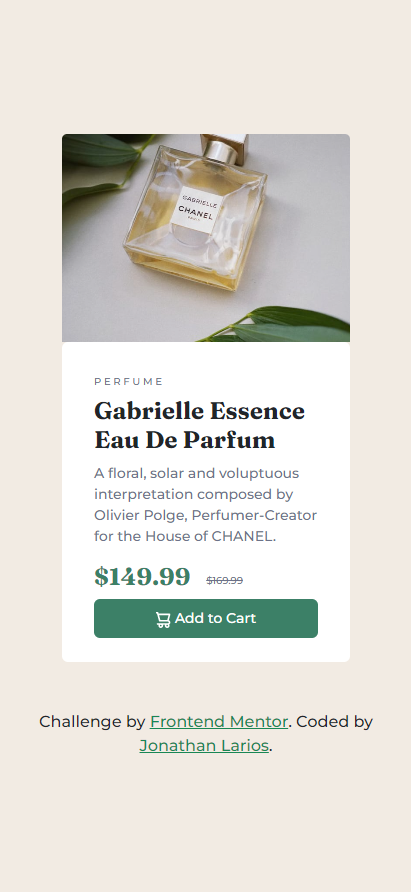

# Frontend Mentor - Product preview card component solution

  

This is a solution to the [Product preview card component challenge on Frontend Mentor](https://www.frontendmentor.io/challenges/product-preview-card-component-GO7UmttRfa). Frontend Mentor challenges help you improve your coding skills by building realistic projects. 

### Links

- Solution URL: [Add solution URL here](https://github.com/JonathanEKP/product-preview)
- Live Site URL: [Add live site URL here](https://jonathanekp.github.io/product-preview/)

## Table of contents

- [Overview](#overview)
  - [The challenge](#the-challenge)
  - [Screenshot](#screenshot)
- [My process](#my-process)
  - [Built with](#built-with)
  - [Useful resources](#useful-resources)
- [Author](#author)

## Overview

### The challenge

Users should be able to:

- View the optimal layout depending on their device's screen size
- See hover and focus states for interactive elements

### Screenshot

##### Home Page

##### Active State

##### Mobile Design

## My process

### Built with

- Semantic HTML5 markup
- CSS custom properties
- Mobile-first workflow
- [Bootstrap](https://getbootstrap.com/) - For styles

### Useful resources

- [Fit image to container size](https://pixonauta.com/ajustar-imagenes-al-tamano-del-contenedor-con-css/) - It helped me to have more control over the cards and to have the same size.
## Author

- Website - [Jonathan Larios](https://jonathanekp.github.io/Portafolio/)
- Frontend Mentor - [@JonathanEKP](https://www.frontendmentor.io/profile/JonathanEKP)
- GitHub - [JonathanEKP](https://github.com/JonathanEKP)

